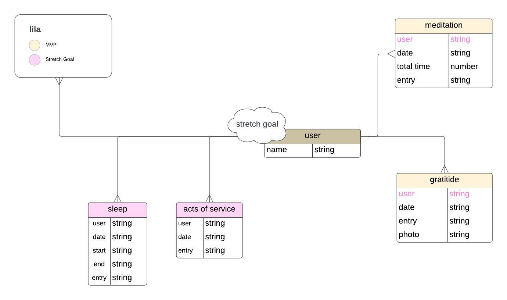
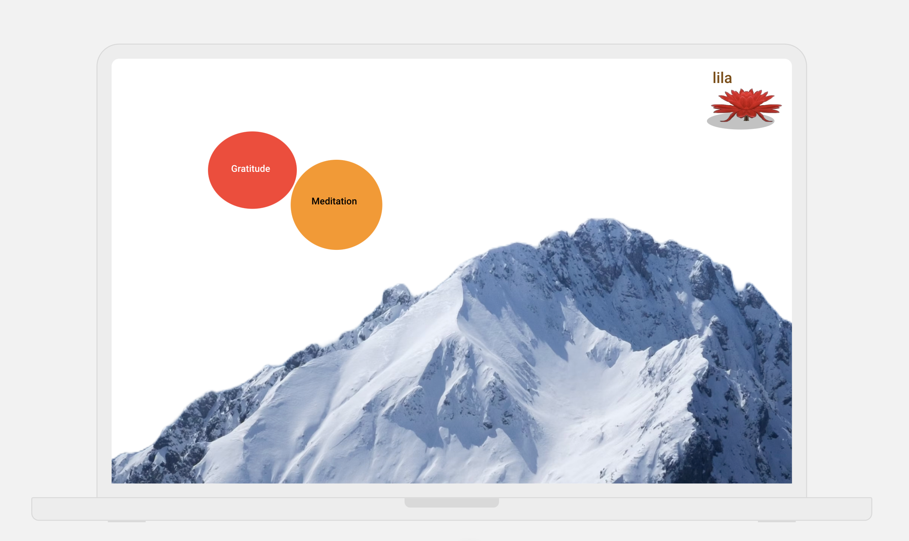
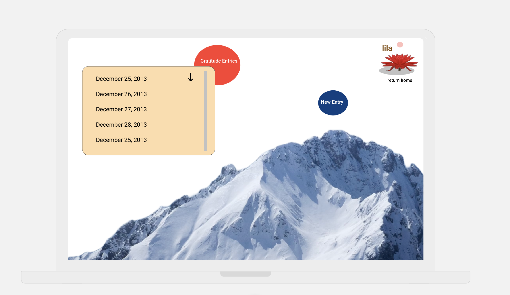
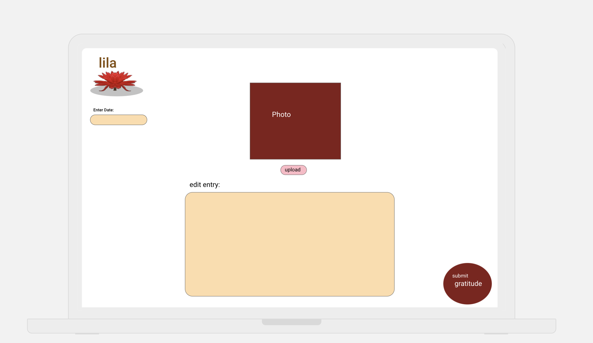
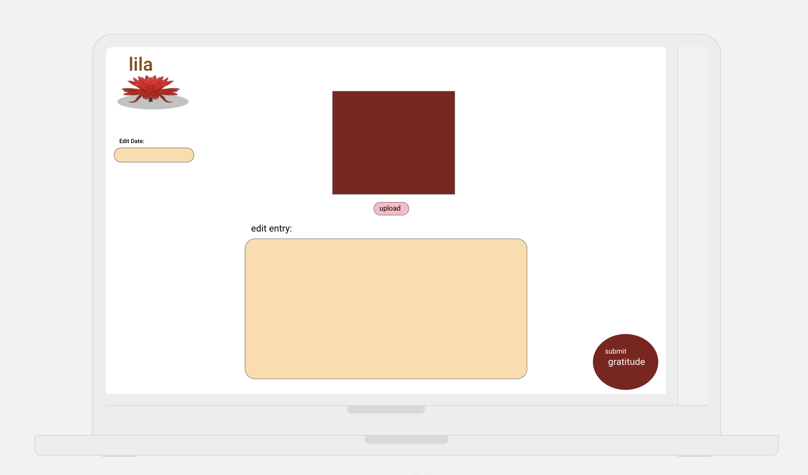
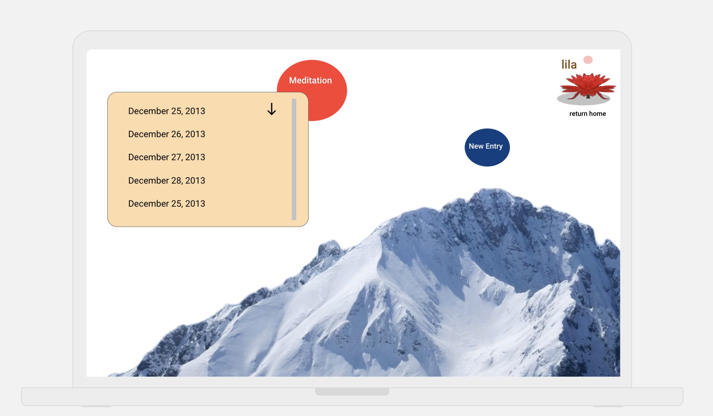
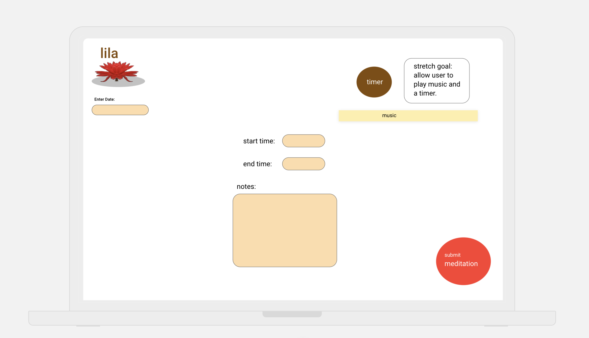
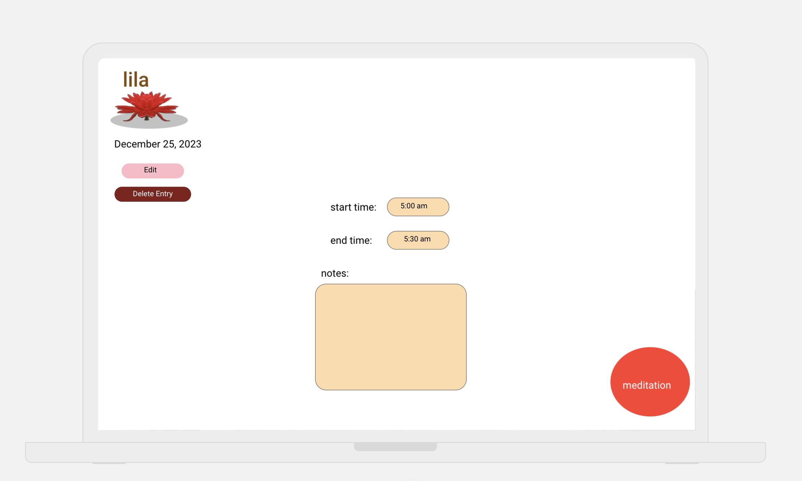

# Lila

## A Meditation and Gratitude Tracker.

An app that allows a user to log their daily meditation and gratude journals. The app allows them to view, edit, and delete post from previous dates.

## ERD

## Wire Frames

**Initial Landing View**

**Choose Meditation or Gratitude View**

**Previous or Create Entries View**

**Create Gratitude View**

**Edit Gratitude View**

**Return to Create Gratitude Entries View**

**Return to Option View**

**Meditation Entries View**

**Meditation Create View**

**Meditation Edit Choices View**

**Meditation Edit View**

**Meditation Entries View**

**Return to Option View**

## User Stories

#### MVP Goals

- As a user, I want to choose either meditation or gratitude, so that I can view or create entries.
- As a user, I want to write my gratitude in the text box, so that its logged for that day.
- As a user, I want to view my gratitude entry for a specific day, so that I can view, edit, or delete it.
- As a user, I want to write my start, end, and notes of a meditation session, so that I can log it for that day.
- As a user, I want to view my meditation entry for a specific day, so that I can view, edit, or delete it.
- As a user, I want to view a button for the home screen on every page, so that i can go back to my options.

#### Stretch Goals

- As a user, I want to see a glowing sphere on the home page, journal and the meditation entries, so that I can have a nice visual effect.
- As a user, I want to use a timer for my meditation journal, so that I can time my session right there.
- As a user, I want to play relaxing music while i create a meditation or gratitude entry, so that I can be immersed into what i'm doing.
- As a user, I want to upload a photo into my gratitude entry, so that I can have a visual representation of what i wrote.
- As a user, I want to be able to create a sleep entry, so that I can track my sleeping patterns. (view, edit, and delete them)
- As a user, I want to be able to create a acts of service entry, so that I can track my them. (view, edit, and delete them and an optional random act service will be generated on the page for that day)

| Method | Route                     | Description                                                            | Action | Redirect/Response                     |
| ------ | ------------------------- | ---------------------------------------------------------------------- | ------ | ------------------------------------- | --- |
| GET    | /home/log-options         | View a button on the home screen to navigate to log options            | -      | res.render('log-options/index')       |
| GET    | /log-options              | Choose between meditation or gratitude to view or create entries       | -      | res.render('log-options/index')       |
| POST   | /gratitude-entries        | Write gratitude in a text box to log for the day                       | create | res.redirect('/whereverYouWant')      |
| GET    | /gratitude-entries/:date  | View gratitude entry for a specific day                                | show   | res.render('gratitude-entries/show')  |
| PUT    | /gratitude-entries/:date  | Edit gratitude entry for a specific day                                | update | res.redirect('/whereverYouWant')      |
| DELETE | /gratitude-entries/:date  | Delete gratitude entry for a specific day                              | delete | res.redirect('/whereverYouWant')      |
| POST   | /meditation-entries       | Write start, end, and notes of a meditation session to log for the day | create | res.redirect('/whereverYouWant')      |
| GET    | /meditation-entries/:date | View meditation entry for a specific day                               | show   | res.render('meditation-entries/show') |
| PUT    | /meditation-entries/:date | Edit meditation entry for a specific day                               | update | res.redirect('/whereverYouWant')      |
| DELETE | /meditation-entries/:date | Delete meditation entry for a specific day                             | delete | res.redirect('/whereverYouWant')      |
| GET    | /home                     | View a button for the home screen on every page                        | -      | res.render('home/index')              |     |
