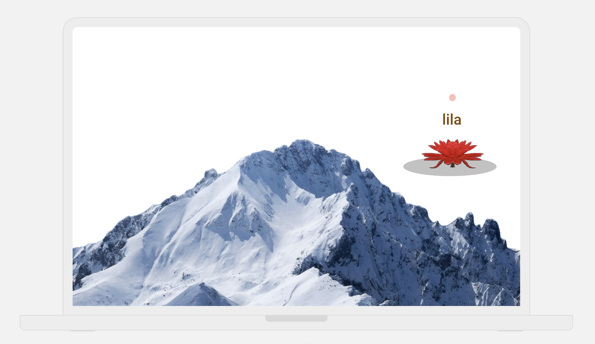
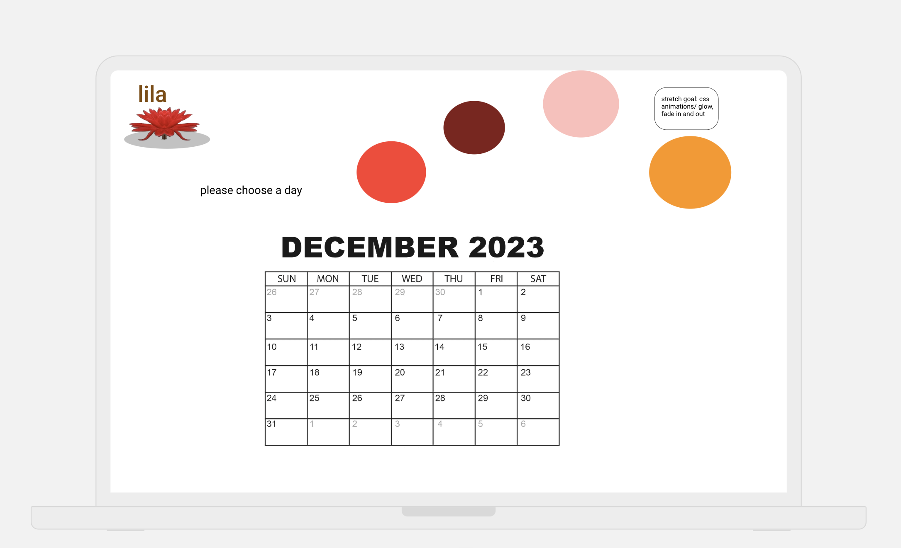
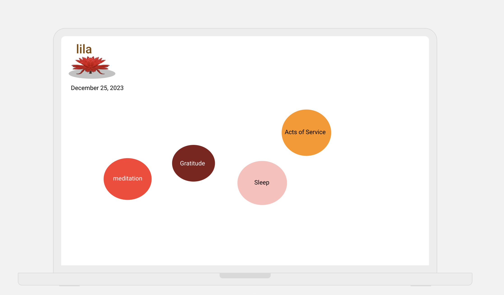
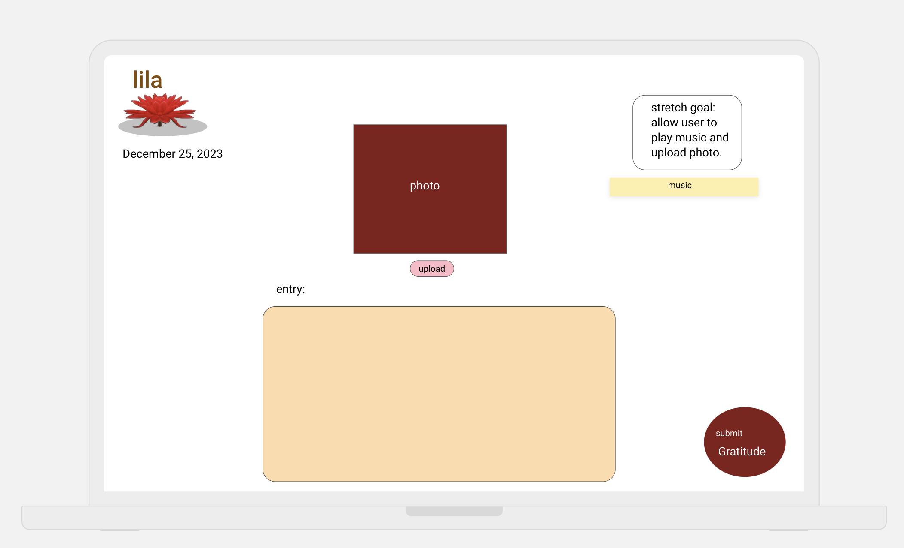
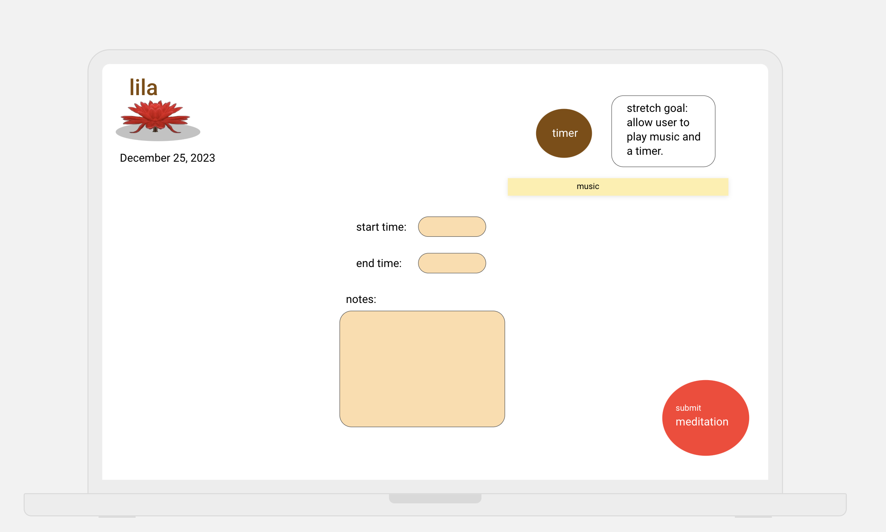
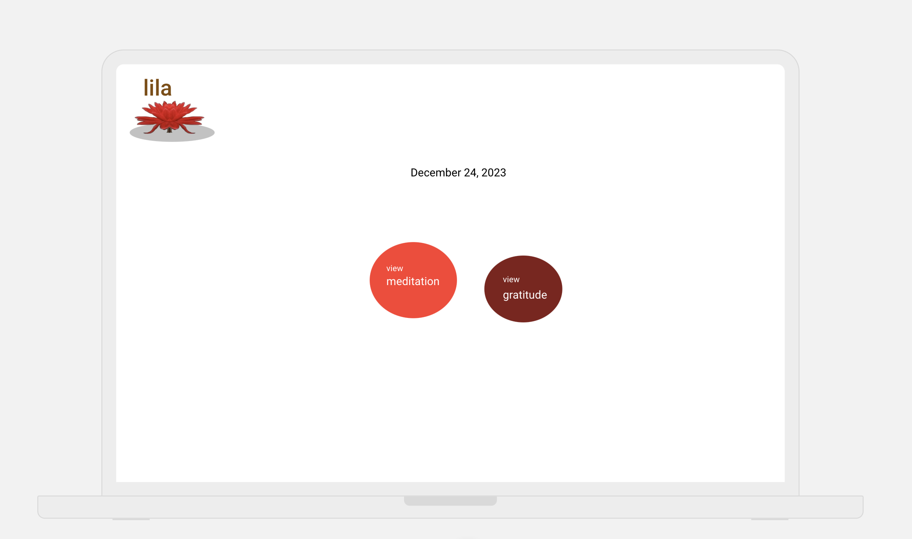
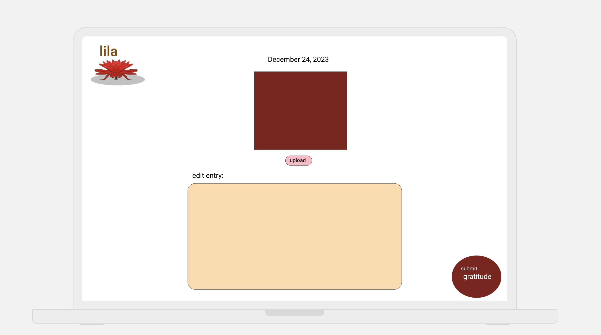
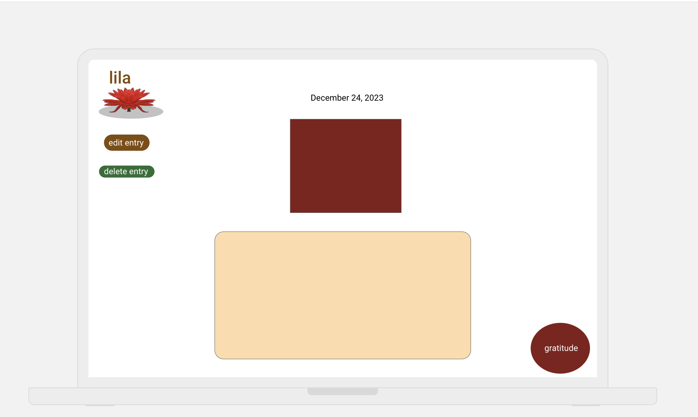

# Lila

## A Meditation and Gratitude Tracker.

An app that allows a user to log their daily meditation and gratude journals. The app allows them to view, edit, and delete post from previous dates.

## Wire Frames

**Initial Landing View**

**Calendar Option View**

**Meditation or Gratitude View**

**Gratitude View**

**Meditation View**

**Previous Entries View**

**Edit Gratitude View**

**Calendar Option View**

## User Stories

#### MVP Goals

- As a user, I want click the calendar to select a date, so that I can view or set the date of entries.
- As a user, I want to choose between meditation log or gratitude log, so that i can view or create a new entry for that day.
- As a user, I want to write my gratitude in the text box, so that its logged for that day.
- As a user, I want to view my gratitude entry for a specific day, so that I can view, edit, or delete it.
- As a user, I want to write my start, end, and notes of a meditation session, so that I can log it for that day.
- As a user, I want to view my meditation entry for a specific day, so that I can view, edit, or delete it.
- As a user, I want to view a button for the home screen on every page, so that i can go back to my options.

#### Stretch Goals

- As a user, I want to see a glowing sphere on the home page, journal and the meditation entries, so that I can have a nice visual effect.
- As a user, I want to use a timer for my meditation journal, so that I can time my session right there.
- As a user, I want to play relaxing music while i create a meditation or gratitude entry, so that I can be immersed into what i'm doing.
- As a user, I want to upload a photo into my gratitude entry, so that I can have a visual representation of what i wrote.
- As a user, I want to be able to create a sleep entry, so that I can track my sleeping patterns. (view, edit, and delete them)
- As a user, I want to be able to create a acts of service entry, so that I can track my them. (view, edit, and delete them and an optional random act service will be generated on the page for that day)

| Method | Route                  | Description                                          | Action | Redirect/Response                  |
| ------ | ---------------------- | ---------------------------------------------------- | ------ | ---------------------------------- |
| GET    | /calendar              | Retrieves current date or date range for calendar    | -      | res.render('calendar/index')       |
| GET    | /log-types             | Retrieves list of available log types                | -      | res.render('log-types/index')      |
| POST   | /gratitude-logs        | Creates a new gratitude log entry for selected date  | create | res.redirect('/whereverYouWant')   |
| GET    | /gratitude-logs/:date  | Retrieves gratitude log entry for specific date      | show   | res.render('gratitude-logs/show')  |
| PUT    | /gratitude-logs/:date  | Updates gratitude log entry for specific date        | update | res.redirect('/whereverYouWant')   |
| DELETE | /gratitude-logs/:date  | Deletes gratitude log entry for specific date        | delete | res.redirect('/whereverYouWant')   |
| POST   | /meditation-logs       | Creates a new meditation log entry for selected date | create | res.redirect('/whereverYouWant')   |
| GET    | /meditation-logs/:date | Retrieves meditation log entry for specific date     | show   | res.render('meditation-logs/show') |
| PUT    | /meditation-logs/:date | Updates meditation log entry for specific date       | update | res.redirect('/whereverYouWant')   |
| DELETE | /meditation-logs/:date | Deletes meditation log entry for specific date       | delete | res.redirect('/whereverYouWant')   |
| GET    | /home                  | Retrieves the home screen with options               | -      | res.render('home/index')           |
